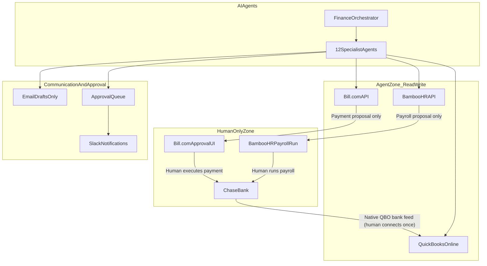
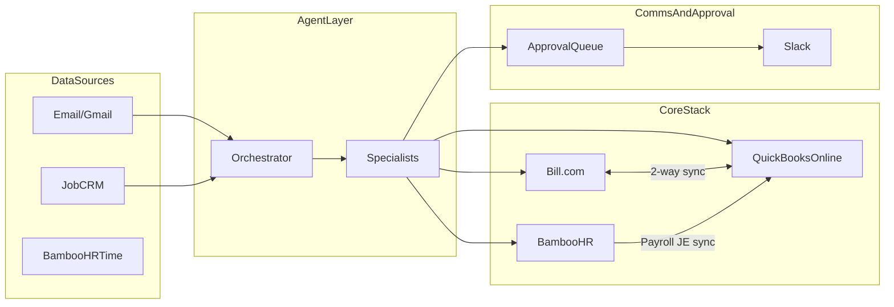
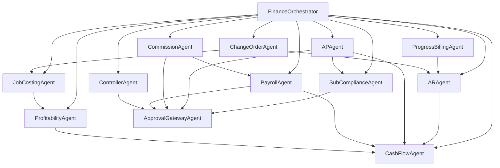

# Finance Agent Architecture — Home Services / Home Improvement

## Executive Summary

**13 agents total:** 1 orchestrator + 12 specialists.

Your stack is **QuickBooks Online (system of record) + Bill.com (AP/payments) + BambooHR (payroll)**. Agents never touch Chase directly. Bank data flows Chase → QuickBooks (native feed, set up once by a human in QBO). Agents read/write only through QuickBooks, Bill.com, and BambooHR APIs.

**Scrap:** Google Sheets receipt tracking and the old Bookkeeper Agent (`extract_expense_details` / `expense_node`).

---

## Security Model: Capable Agents, No Bank Access

### The Golden Rule

> **Agents operate on accounting and approval systems, never on bank credentials.**

### Chase: QuickBooks, Not Plaid (for agents)

| Approach | Who connects | Agent access | Recommendation |
|---|---|---|---|
| **QBO native bank feed** | You or your bookkeeper, once, in QBO settings | None — agent reads transactions from QBO API only | **Use this** |
| **Plaid → your app** | Your app holds Plaid tokens | Agent could read balances/transactions directly | **Skip** — unnecessary attack surface |
| **Plaid → QBO** | QBO uses Plaid under the hood for Chase | Same as row 1 — agent still only sees QBO | This is what QBO already does |

**Why QuickBooks is enough:** Chase transactions appear in QBO within 24–48 hours. Your Controller Agent reconciles against QBO bank register data. For AP payments, Bill.com handles disbursement after human approval — the agent never initiates a wire/ACH.

**When you might add Plaid later (still no agent access):** A separate read-only cash dashboard service (not an LLM agent) with scoped Plaid tokens for real-time balance display. Keep it outside the agent loop.

### Permission Tiers

| Tier | Systems | Agent can do | Human must do |
|---|---|---|---|
| **Read** | QBO, Bill.com, BambooHR | Query invoices, bills, jobs, payroll, bank register (via QBO) | — |
| **Propose** | QBO, Bill.com, BambooHR | Create draft bills, invoices, JEs, payment batches, commission accruals | — |
| **Approve** | Bill.com, BambooHR, Approval Queue | — | Approve/reject every payment and payroll run |
| **Execute** | Chase | — | All money movement |

### Audit Trail Requirements

Every agent action logs: `agent_name`, `action`, `entity_id`, `before_state`, `after_state`, `timestamp`, `human_approver` (if applicable). No silent writes to QBO or Bill.com.

---

## Integration Architecture

### QuickBooks Online — System of Record

- Chart of accounts, customers, vendors, jobs (classes/projects)
- Invoices, bills, journal entries, bank register
- Job costing via **Classes** or **Projects** (enable Projects in QBO for home services)
- Bank reconciliation data (fed by Chase → QBO native connection)

**Agent API scope:** `com.intuit.quickbooks.accounting` — read all, write invoices/bills/JEs/expenses. No payment execution scope.

### Bill.com — AP and Payment Rail

- Vendor bill intake, approval workflows, payment scheduling
- Native 2-way sync with QBO (bills, vendors, payments post back to QBO)
- Built-in multi-step approval chains
- Slack integration for approval notifications
- Webhooks for bill-approved, payment-scheduled, payment-completed events

**Agent API scope:** Create/update bills, assign approvers, propose payment batches. **Never** call payment execution endpoints — route to Bill.com approval UI.

### BambooHR — Payroll (Salaries + Commissions)

- Employee records, time tracking, payroll runs
- Commission payments processed through BambooHR payroll (alongside salaries)
- Native QBO integration: payroll journal entries sync to QuickBooks (with QBO Classes for department/job allocation)
- Payroll must be approved and run by a human in BambooHR

**Agent API scope:** Read employee data, time entries, payroll preview. Propose commission amounts for payroll inclusion. **Never** trigger payroll execution.

### Communication Layer

| Channel | Use |
|---|---|
| **Slack** | Approval requests, exception alerts, daily financial summary, AR aging alerts |
| **Email (draft only)** | Customer invoices, collections follow-ups, vendor inquiries, homeowner communications |
| **Approval Queue** | Centralized inbox for all agent proposals requiring human sign-off (commissions, JEs, large bills) |

### Approval Layer

| Workflow | Where approval happens |
|---|---|
| Vendor bills under threshold | Bill.com auto-route to manager |
| Vendor bills over threshold | Bill.com → owner/CFO chain |
| Commission payouts | Agent proposes → Approval Queue → Slack → human adds to BambooHR payroll |
| Payroll run | BambooHR native approval (agent only pre-validates) |
| Journal entries / adjustments | Approval Queue → human posts to QBO |
| Customer credit memos | Approval Queue |

---

## The 13 Agents

### Tier 1: Core Financial Agents (8)

#### 1. Finance Orchestrator

Routes all financial events to the correct specialist. Enforces permission tiers and deduplication.

**Triggers:** Email, Bill.com webhooks, QBO webhooks, BambooHR events, scheduled jobs (daily close check, weekly AR aging).

**Enhanced capabilities:**
- Priority scoring (overdue AR > routine AP > reporting)
- Cross-agent conflict detection (duplicate bill in QBO and Bill.com)
- Policy enforcement (no payment proposal without approved bill)
- Event bus for agent-to-agent handoffs

---

#### 2. AR Agent (Accounts Receivable)

**Enhanced capabilities:**
- Create QBO progress invoices from job milestones
- Track customer deposits and apply to final invoice
- AR aging with homeowner-specific follow-up cadence (7/14/30/60 day)
- Payment matching (QBO bank deposit → open invoice)
- Draft collections emails (never auto-send)
- Lien rights tracking alerts (state-specific deadlines for home improvement)
- Integration with job system for "job complete → final invoice" trigger

---

#### 3. AP Agent (Accounts Payable) — Bill.com Powered

Replaces the old Bookkeeper Agent entirely.

**Enhanced capabilities:**
- Receive vendor bills via email → create in Bill.com with GL + job coding
- 3-way match: PO/receipt/bill (for material orders)
- Route to correct approver based on amount, vendor, job
- Propose payment batches in Bill.com (human approves in Bill.com UI)
- Track 1099-eligible vendor spend
- Subcontractor bill validation (requires COI on file — handoff to Compliance Agent)
- Sync status monitoring (Bill.com ↔ QBO)

---

#### 4. Commission Agent

**Enhanced capabilities:**
- Rules engine: % of sale, % of gross margin, tiered by job size, split between sales rep and lead setter
- Attribution: tie commission to QBO job/project and sales rep
- Clawback rules (cancelled jobs, warranty callbacks within 90 days)
- Accrual at job milestone (% complete or job close)
- Monthly commission statement generation
- Propose commission amounts to Payroll Agent (does not pay directly)
- Dispute tracking and resolution workflow

---

#### 5. Payroll Agent (NEW)

Coordinates all compensation disbursement. Separate from Commission Agent (calculates) and AP Agent (vendor payments).

**Enhanced capabilities:**
- Read BambooHR employee data, time entries, PTO
- Receive approved commission amounts from Commission Agent
- Pre-validate payroll: total labor cost vs. job budget, overtime flags
- Allocate payroll costs to QBO jobs/classes (via BambooHR → QBO JE sync)
- Propose payroll adjustments (bonus, commission additions, corrections)
- Reconcile BambooHR payroll JEs in QBO after each run
- Certified payroll reporting support (if you do government/Prevailing Wage work)
- **Human runs payroll in BambooHR** — agent only prepares and validates

---

#### 6. Job Costing Agent

**Enhanced capabilities:**
- Real-time job P&L: estimated vs. actual for labor, materials, subs, permits
- Cost allocation from QBO expenses tagged to job class/project
- Labor cost from BambooHR time × burden rate
- Material cost from vendor bills (Bill.com → QBO)
- Subcontractor cost tracking per job
- Overhead allocation (vehicle, insurance, office) by revenue or labor hours
- Budget variance alerts at 80%/100%/120% of estimate
- WIP (work-in-progress) asset tracking for jobs spanning multiple months

---

#### 7. Profitability Agent (Reporting / Analytics)

**Enhanced capabilities:**
- Company P&L, balance sheet, cash flow statement (from QBO)
- Gross margin and net margin by job type (kitchen, bath, roofing, etc.)
- Rep/crew profitability ranking
- Seasonal trend analysis (home services is highly seasonal)
- Estimate-to-actual variance reports
- Dashboard pushed to Slack daily/weekly
- Board-ready monthly financial package

---

#### 8. Controller Agent (Reconciliation and Clean Financials)

**Enhanced capabilities:**
- Bank reconciliation using QBO bank register (Chase data, no direct Chase access)
- Match QBO transactions to AR receipts, AP payments, payroll JEs
- Month-end close checklist (15+ steps, tracked to completion)
- Propose adjusting journal entries (with Approval Queue)
- Data quality: uncoded transactions, duplicate bills, orphaned payments
- Intercompany/account balance verification
- Audit trail review and exception queue
- 1099 prep support (cross-reference AP Agent vendor data)

---

### Tier 2: Home Services / Home Improvement Agents (4)

#### 9. Progress Billing Agent

Home improvement jobs run weeks to months. This agent handles milestone-based revenue.

**Capabilities:**
- Deposit invoice at contract signing (typically 30–50%)
- Progress/draw invoices at defined milestones (demo complete, rough-in, finish)
- Retainage holdback tracking (5–10% until punch list complete)
- Final invoice minus deposits and retainage
- Sync all invoices to QBO, linked to job/project
- Alert when billing is behind job completion % (you've done 60% of work but only billed 30%)

---

#### 10. Change Order Agent

Scope changes are the #1 margin killer in home improvement.

**Capabilities:**
- Intake change orders from email, job system, or field reports
- Calculate margin impact (additional revenue vs. additional cost)
- Generate change order invoice in QBO
- Update job budget in Job Costing Agent
- Require customer approval before work begins (draft email with change order doc)
- Track unsigned change orders as risk items on job P&L

---

#### 11. Subcontractor Compliance Agent

Home services relies heavily on subs. Non-compliance = liability.

**Capabilities:**
- Track Certificate of Insurance (COI) expiration per sub
- Block AP Agent from approving sub bills if COI expired
- Lien waiver collection: conditional at payment, unconditional after clearance
- 1099 tracking and year-end prep (feeds Controller Agent)
- Subcontractor W-9 on file verification
- Compliance dashboard and expiration alerts via Slack

---

#### 12. Cash Flow Agent

Home improvement is cash-intensive (materials upfront, labor weekly, customer pays on milestones).

**Capabilities:**
- 13-week rolling cash flow forecast (from QBO AR/AP/payroll data)
- "Can we afford this job?" analysis before signing (materials + labor outflow vs. billing schedule)
- Seasonal cash planning (slow winter months)
- Alert when projected cash drops below threshold
- Model impact of accelerating AR collections or deferring AP
- **Reads from QBO only** — no direct bank access

---

### Tier 3: Orchestration Support (1)

#### 13. Approval Gateway Agent

Not a domain specialist — a cross-cutting workflow agent.

**Capabilities:**
- Central approval queue for all agent proposals
- Route to correct approver by type, amount, and urgency
- Slack interactive messages (Approve / Reject / Ask Question)
- Escalation on timeout (24h → manager, 48h → owner)
- Full audit log of every approval decision
- Batch approvals for routine items (e.g., 15 small material bills)

---

## Agent Interaction Map

---

## What to Scrap from Current Codebase

| Remove | Replace with |
|---|---|
| `extract_expense_details()` in `src/agents.py` | AP Agent → Bill.com bill creation |
| `expense_node` in `src/graph.py` | AP Agent node |
| `RECEIPT` triage category | `BILL`, `INVOICE`, `VENDOR_DOC` categories |
| `append_to_sheet()` calls | QBO API + Bill.com API |
| `RECEIPTS_SHEET_ID` config | `QUICKBOOKS_REALM_ID`, `BILLCOM_ORG_ID`, `BAMBOOHR_SUBDOMAIN` |
| Google Sheets scope in `SCOPES` | Remove `spreadsheets` scope (keep Drive for document storage if needed) |

---

## Recommended Build Order

| Phase | Agents | Integrations |
|---|---|---|
| **1 — Foundation** | Controller, Approval Gateway | QBO API, Chase→QBO bank feed (manual setup) |
| **2 — Money In** | AR, Progress Billing | QBO invoicing, job system |
| **3 — Money Out** | AP, Sub Compliance | Bill.com API, Bill.com↔QBO sync |
| **4 — Jobs** | Job Costing, Change Order | QBO Projects/Classes, job system |
| **5 — People** | Commission, Payroll | BambooHR API, BambooHR→QBO JE sync |
| **6 — Intelligence** | Profitability, Cash Flow | QBO reporting, Slack dashboards |
| **7 — Orchestration** | Finance Orchestrator | Wire all agents, webhooks, event bus |

---

## Agent Count Summary

| # | Agent | Tier | Primary integration |
|---|---|---|---|
| 1 | Finance Orchestrator | Core | All systems |
| 2 | AR Agent | Core | QBO |
| 3 | AP Agent | Core | Bill.com → QBO |
| 4 | Commission Agent | Core | QBO + job system |
| 5 | Payroll Agent | Core | BambooHR → QBO |
| 6 | Job Costing Agent | Core | QBO Projects/Classes |
| 7 | Profitability Agent | Core | QBO (read-only) |
| 8 | Controller Agent | Core | QBO (bank register) |
| 9 | Progress Billing Agent | Home services | QBO + job system |
| 10 | Change Order Agent | Home services | QBO + job system |
| 11 | Subcontractor Compliance Agent | Home services | Bill.com + document store |
| 12 | Cash Flow Agent | Home services | QBO (read-only) |
| 13 | Approval Gateway Agent | Cross-cutting | Slack + approval queue |

**Total: 13 agents.**

---

## Open Questions for Implementation

1. **Job system of record** — What do you use today? (Jobber, ServiceTitan, Buildertrend, HubSpot, spreadsheets?) Job Costing and Progress Billing agents need this.
2. **Commission rules** — Flat % of sale, % of gross margin, or tiered by job size? Paid at contract signing, milestone, or job completion?
3. **Approval thresholds** — Dollar amounts that trigger different approval chains (e.g., <$500 auto-approve, $500–$5K manager, >$5K owner).
4. **Slack vs. email for approvals** — Slack is recommended for speed; confirm your team uses it.
5. **Prevailing wage / certified payroll** — Do you do any government or commercial work requiring certified payroll reports?
